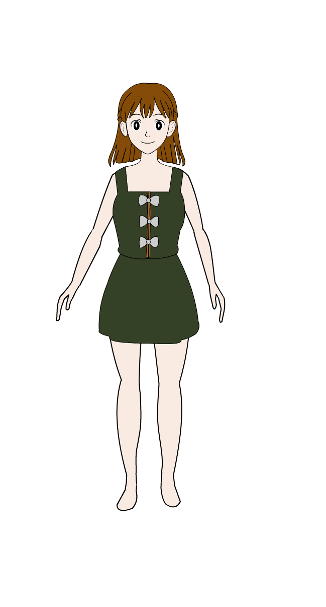

<!-- Save this as index.html -->
<!DOCTYPE html>
<html lang="en">
<head>
  <meta charset="UTF-8" />
  <meta name="viewport" content="width=device-width, initial-scale=1.0"/>
  <title>Bhawna Creatives</title>
  <link href="https://fonts.googleapis.com/css2?family=Inter:wght@400;600;800&display=swap" rel="stylesheet">
  
</head>
<body>

  <header>
    
    <h1>Welcome to Bhawna Creatives</h1>
    

      Where imagination finds its wings —
        animations that soothe your soul,
        illustrations that tell your story,
        and visuals that connect emotions.
    

  </header>

  <nav>
    <a href="#animation">Animation</a>
    <a href="#illustration">Illustration</a>
    <a href="#bookedits">Services</a>
    <a href="#feedback">Feedback</a>
    <a href="projects.html">Upcoming Projects</a>
  </nav>

  <section id="animation">
    <h2>🌟 Featured Animation</h2>
    <video controls width="80%" style="max-width:600px; border-radius: 1rem; box-shadow: 0 4px 10px rgba(0,0,0,0.1); display: block; margin: 0 auto;">
      <source src="b2.mp4" type="video/mp4" />
      Your browser does not support the video tag.
    </video>
    

      🔗 <a href="https://www.youtube.com/@yAsmrbabe12" target="_blank">Watch more on YouTube</a>
    

  </section>

  <section id="illustration">
    <h2>🖌 Illustrations</h2>
    

      
      
      
    

  </section>

  <section id="bookedits">
    <h2>💖 Services & Cost</h2>
    <ul>
      <li>✨ 2D Animation – ₹800/min (1 revision)</li>
      <li>✨ 2D Animation – ₹1000/min (2 revisions)</li>
      <li>🎨 Character Illustration – ₹200/character</li>
      <li>🎮 Infographic Edits – ₹400/min</li>
    </ul>
    <a class="button" href="mailto:bhartibhawna4488@example.com">Email to Book</a>
  </section>

  <section id="feedback">
    <h2>💬 Feedback & Comments</h2>
    <form>
      <textarea rows="4" placeholder="Leave a comment or feedback..."></textarea>
       
      <button class="button">Submit Feedback</button>
    </form>
  </section>

  <footer>
    
📧 bhartibhawna4488@example.com |
      <a href="https://www.behance.net/bhawnabharti48" target="_blank">Behance</a>
    

    
© 2025 Bhawna Creatives

  </footer>

</body>
</html>
